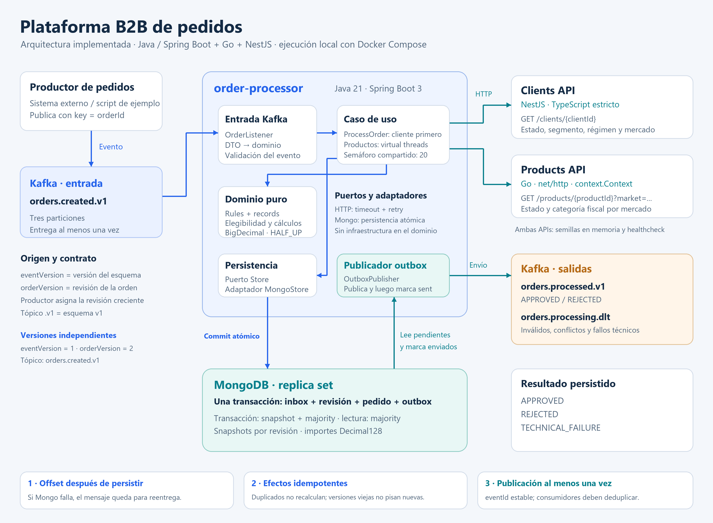
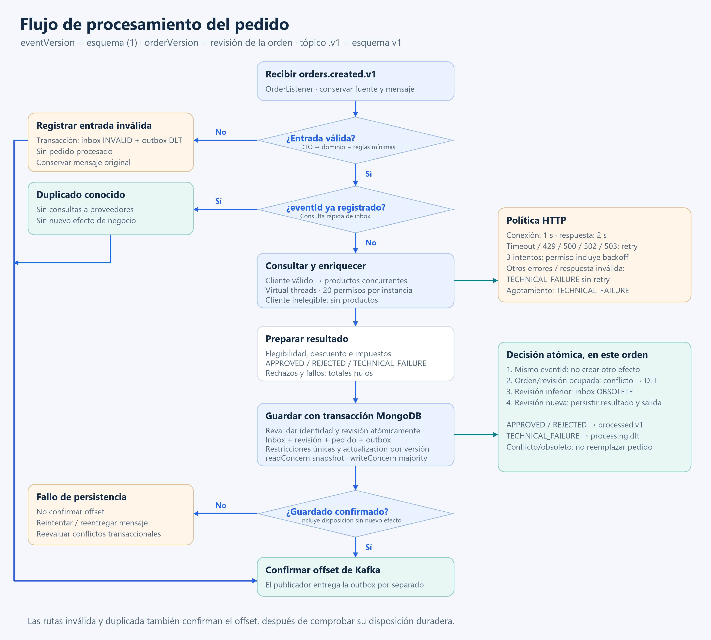
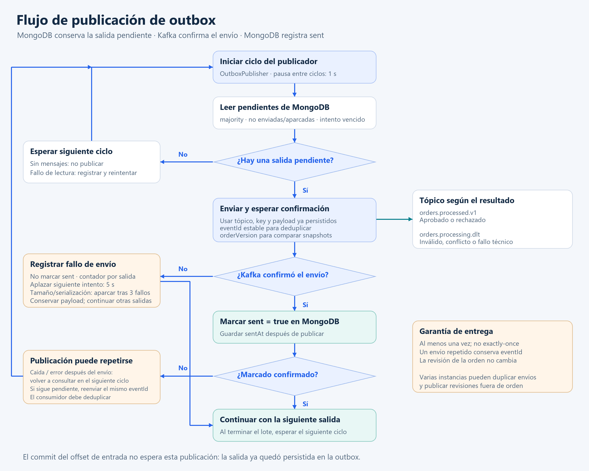

# Arquitectura y flujos de la plataforma B2B

Diagramas contrastados con el código: eventVersion es la versión del esquema (1); orderVersion es la revisión de la
orden; .v1 identifica el contrato en el tópico. La salida conserva orderVersion y usa eventVersion=1.

## Arquitectura

[Versión SVG](images/arquitectura-b2b.svg)

## Procesamiento de pedidos

[Versión SVG](images/flujo-procesamiento-b2b.svg)

El caso de uso prepara el resultado antes de guardar. MongoStore revalida la identidad y revisión dentro de la
transacción: duplicado, conflicto de orden/revisión, obsoleto o nuevo resultado. Las flechas azules representan control
del flujo; los paneles laterales conectados en verde detallan reglas de la etapa, no servicios adicionales. Un fallo de
persistencia en cualquier ruta impide confirmar el offset.

## Publicación de outbox

[Versión SVG](images/flujo-outbox-b2b.svg)

La publicación ocurre después del commit MongoDB y no bloquea el offset de entrada. El publicador envía primero y marca
sent después. Una caída puede repetir el mismo eventId; consumidores deduplican y comparan orderVersion. La DLT conserva
mensaje original, sourceEventVersion (esquema recuperable) y orderVersion.

El enriquecimiento consulta primero al cliente y omite productos si no es elegible. Después usa virtual threads con
semáforo compartido por instancia (`PRODUCTS_CONCURRENCY`, default 20), incluidos retries. Espera el cierre de las
tareas
antes de persistir; la interrupción no confirma offsets. El ADR 001 describe cancelación y orden determinista de
errores.

La transacción usa snapshot/majority; la outbox se lee con majority. Sus fallos de envío se aíslan por registro,
con espera de 5 s por defecto y aparcamiento tras 3 errores de tamaño/serialización. Mongo indisponible detiene el
ciclo.
Los eventos son snapshots completos, con saltos de versión permitidos; un fallo técnico se recupera mediante nueva
revisión autorizada.
