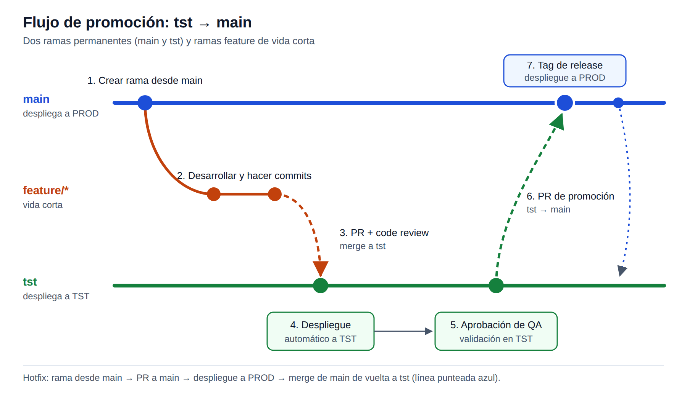

# Conducción técnica de un equipo de cuatro personas

## División y acuerdos iniciales

| Responsable              | Ownership                                                | Criterio de integración                          |
|--------------------------|----------------------------------------------------------|--------------------------------------------------|
| A: worker/dominio        | Cálculos, elegibilidad, validación y contrato de eventos | Casos tabulados y sin imports de infraestructura |
| B: Products              | Go, catálogo por mercado, OpenAPI, cancelación           | Handler real contra ejemplos acordados           |
| C: Clients               | NestJS, semillas, validación y OpenAPI                   | Endpoint y errores con TypeScript estricto       |
| D: integración/Tech Lead | Inbox/outbox, Kafka/Mongo, Compose, CI y operación       | Demo reproducible con fallos y duplicados        |

El Tech Lead mantiene responsabilidad por el flujo completo, revisa cambios en invariantes y desbloquea dependencias. A
y D revisan juntos la atomicidad; B y C revisan el consumo de sus contratos. Esta tabla describe un equipo hipotético
requerido por la evaluación, no autores reales del repositorio.

Antes de programar: acordar IDs, eventVersion como versión del esquema, orderVersion como revisión creciente asignada
por el productor, moneda/mercado, errores, semillas y ejemplos. Los cambios incompatibles del esquema se coordinan con
nuevos tópicos versionados. Contratos primero; los proveedores trabajan con handlers y el worker con puertos falsos.
Integrar HTTP antes de conectar consumidor y persistencia.

## Branches, revisión y CI

El repositorio usa solo dos ramas permanentes:

- `master`: refleja lo que está en producción.
- `tst`: integra y valida los cambios antes de producción.

Las ramas `feature/*` y `fix/*` son temporales y se eliminan al fusionarse.

### Cómo funciona

1) Crear una rama `feature/<descripcion>` desde `master`, para partir siempre de lo que está en producción.
2) Desarrollar y hacer commits en esa rama.
3) Abrir un Pull Request (PR) hacia `tst`. Aquí se hace la revisión de código.
4) Al fusionar, los cambios se despliegan en el entorno de TST.
5) QA valida y aprueba los cambios en TST.
6) Promover a `master` solo los commits aprobados (ver siguiente sección).
7) Crear un tag de versión y desplegar a PROD.

**Hotfixes:** crear `fix/<descripcion>` desde `master`, abrir el PR directo hacia `master` y desplegar. Después,
fusionar `master` en `tst` para que ambas ramas no se desincronicen (Reverse merge).

### Promoción de cambios

`tst` puede contener trabajo aún no aprobado, por eso no se fusiona completa en `master`. Se crea una rama desde
`master`, se hace cherry-pick de los commits aprobados en TST y se abre un PR hacia `master`. Así solo llega a
producción lo que QA validó.

### Convenciones de ramas y PR

- Cada persona trabaja en su propia rama corta; nadie escribe directamente en `tst` ni en `master`.
- Las dependencias entre cambios se indican en el PR. Si un cambio necesita una API aún no publicada, primero se acuerda
  el contrato y se usan dobles de prueba hasta integrar.
- Mantener los cambios pequeños y listos para entregar, para que el cherry-pick sea simple.
- Si `master` cambia durante el desarrollo, actualizar la rama desde `master`, volver a correr CI y resolver
  conflictos antes de aprobar el PR.

Cada PR describe el problema, el cambio observable, la evidencia de pruebas y los riesgos. Requiere al menos una
aprobación; los cambios en contratos o consistencia requieren además al dueño proveedor/consumidor o a A+D. No mezclar
refactors no relacionados con cambios de reglas.

Proteger `master` y `tst` con PR obligatorio, aprobación y checks requeridos; bloquear pushes directos y force-push.
Estas son políticas propuestas: documentarlas no configura la protección de ramas en GitHub.

### CI

CI mínimo: compilar los tres servicios y ejecutar pruebas unitarias, de handlers/endpoints, validación de contratos y
ejemplos, Testcontainers y un smoke test con Compose.

Rechazar cambios que produzcan importes no deterministas, efectos duplicados, offsets adelantados, errores sin
clasificar o acoplamiento del dominio con la infraestructura. Aprobar decisiones técnicas cuando haya un problema
concreto, alternativas, evidencia y un coste razonable. No imponer el mismo framework o patrón en los tres lenguajes.

El workflow `verify` actual se ejecuta en cada `push` y `pull_request` sin filtrar ramas, así que ya cubre esta
estrategia. Todavía no despliega automáticamente a TST ni a PROD; ese paso queda pendiente. Las aprobaciones en `tst`
y las promociones a `master` deben quedar registradas en los PR; exigir checks obligatorios requiere permisos de
administración del repositorio.

## Incrementos, despliegue y rollback

1. Reglas y APIs funcionales con contratos y ejemplos.
2. Flujo feliz persistido con constraints y outbox desde el primer despliegue.
3. Fallos, duplicados, recuperación y evidencia automatizada.
4. Preparación productiva: credenciales/TLS, redundancia, SLO, alarmas y política de retención.

En producción: crear índices y validar compatibilidad primero; desplegar proveedores compatibles; canary del worker
dentro del grupo, observando lag, fallos y pendientes. Expandir gradualmente. Rollback restaura imagen compatible con
esquemas existentes; no elimina inbox/revisiones ni resetea offsets para forzar resultados. Cambios incompatibles usan
nuevos tópicos/contratos coexistentes, con procedimiento separado de migración. Un cálculo incorrecto ya publicado
necesita evento correctivo con revisión superior, no una restauración silenciosa de la base.

Una corrección de código sigue el mismo flujo de ramas. Para revertir una entrega, usar un `git revert` revisado en PR
y una imagen compatible, conservando la trazabilidad del commit. Después, fusionar `master` en `tst` para no
reintroducir el defecto en la siguiente promoción. No usar reset ni force-push para simular un rollback.

## Riesgos

| Riesgo                    | Responsable | Mitigación                                                                                 |
|---------------------------|-------------|--------------------------------------------------------------------------------------------|
| Carrera/efecto duplicado  | D + A       | Restricciones, transacción y pruebas concurrentes                                          |
| Interpretación monetaria  | A           | Casos manuales con negocio y pruebas parametrizadas                                        |
| Ruptura de contratos      | B/C + A     | Ejemplos versionados, review consumidor/proveedor                                          |
| Saturación de proveedores | B/C + D     | Timeouts, presupuesto de retry, semáforo compartido y medición antes de aumentar su límite |
| Acumulación de outbox     | D           | Antigüedad, alarma, capacidad y retención segura                                           |

## Desacuerdos

Separar a las personas del problema. Un desacuerdo técnico sano muestra un equipo involucrado; el riesgo es que se
vuelva personal o se estanque. El objetivo no es elegir un ganador, sino llegar a la mejor decisión con ambos
comprometidos.

1. **Escuchar por separado** (si hay tensión): entender postura, preocupaciones y trasfondo. A veces el problema real
   es carga de trabajo, ownership o una mala experiencia previa con esa tecnología.
2. **Estructurar la discusión**: cada propuesta expone problema que resuelve, supuestos, riesgos y costo de
   implementación y mantenimiento. Cada uno explica la postura del otro antes de defender la suya; si el otro la
   valida, la fricción baja.
3. **Criterios antes que solución**: definir qué importa más (rendimiento, simplicidad, plazo, costo operativo,
   alineación con la arquitectura) para comparar con criterios y no opiniones.
4. **Usar datos**: si la diferencia es real y equivocarse es caro, un spike acotado (uno o dos días) resuelve más que
   seguir debatiendo.
5. **Decidir con claridad**: sin consenso, decide el Tech Lead (o quien tenga la autoridad técnica), explicando el
   razonamiento, reconociendo los méritos de la opción descartada y pidiendo "disagree and commit".
6. **Documentar en un ADR**: contexto, opciones, decisión y porqué. Evita reabrir el tema, registra el análisis de la
   propuesta descartada y fija una condición de revisión (p. ej., "si la latencia supera X, reevaluamos B").
7. **Cerrar el ciclo**: hablar en privado con quien "perdió" para reconocer su aporte y evitar resentimiento. Si luego
   la otra opción resulta mejor, admitirlo abiertamente; eso genera confianza.

## Definición de terminado productivo

Un cambio está listo para producción cuando:

- Contratos y runbooks están revisados.
- Las pruebas de fallos y concurrencia pasan.
- La compilación y el despliegue son reproducibles.
- Permisos, secretos y TLS están configurados.
- Réplicas y backups están probados.
- Cada alarma es accionable y tiene responsable.
- La latencia está validada con pruebas de carga.
- El rollback compatible está ensayado.
- El código generado con IA tiene revisión humana.

La entrega local todavía no cumple estas condiciones.
